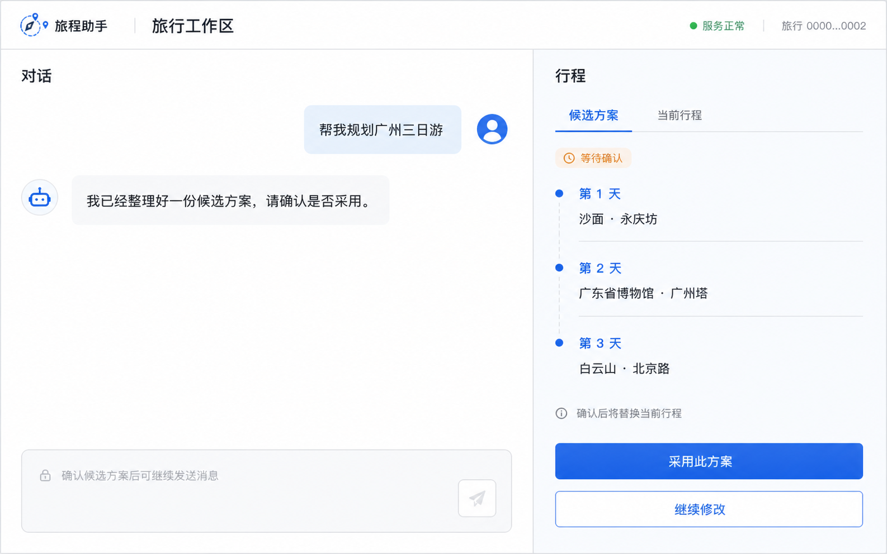

# 旅行助手 Agent

一个基于 LangGraph 的个人学习项目。它面向中国大陆旅行场景，通过受约束的多模块编排、旅行信息查询和候选行程确认，完成从“想去哪里”到“怎样安排行程”的对话式协作。



## 已实现能力

- **受约束编排**：根图将一次请求拆成最少必要的顺序 Task，并确定性进入 Planning、Explore、Research 或 Helper 子图。
- **旅行规划**：Planning Agent 可维护动态 `TripContext`、生成候选行程，并在用户确认后写入当前行程。
- **开放探索与深度调研**：Explore 用于发现目的地和活动；Research 用于围绕明确对象制定计划、采集证据并综合结论。
- **公共查询 Tools**：支持当前时间、日期计算、天气、地点详情、周边搜索、路线与距离、网页搜索/提取/站点发现与抓取。
- **历史记忆**：原始对话保存在 PostgreSQL；语义增强后的对话 Chunk 使用 pgvector 召回，并通过 Reranker 和语义去重压缩结果。
- **流式交互**：`POST /messages/stream` 通过 SSE 推送任务进度、回复 Token、候选确认和最终结果。
- **运行控制**：同一 `thread_id` 串行运行，前端幂等键避免网络重试导致重复执行；`interrupt/resume` 用于 Agent 的主动追问。

## 当前边界

- 仅面向中国大陆的公开旅行信息查询。
- 不执行真实购票、下单、支付、退改签等高风险操作；涉及此类请求时只提供公开信息或安全说明。
- 外部搜索、天气和地图数据存在时效性与准确性限制，不能替代官方渠道。
- Checkpointer 当前驻留进程内存，服务重启后不能恢复等待中的图运行。

## 架构概览

```text
Web 前端（Vue 3）
        │ HTTP / SSE
        ▼
FastAPI ── 运行控制 / 幂等键 / thread 锁
        ▼
LangGraph 根图（Orchestrator）
        │ 最小必要 Task + 确定性调度
        ├── Planning：生成、修改、确认行程
        ├── Explore：开放式目的地探索
        ├── Research：计划、调查、综合
        └── Helper：轻量查询、解释与安全兜底
        │
        ▼
PostgreSQL + pgvector
Conversation / TripContext / CurrentItinerary / RAG Chunk / 幂等记录
```

一次请求由 Orchestrator 生成计划并顺序执行子图。子图结束后返回 `TaskResult`，根图可据此继续、替换剩余任务或结束。行程变更需要先提交候选方案，只有用户确认后才会成为 `CurrentItinerary`；完整行程由后端独立返回，不重复塞进普通对话。

更多设计说明见 [docs/README.md](docs/README.md)。

## 技术栈

| 层次 | 选型 |
| --- | --- |
| 后端 | Python 3.12、FastAPI、Uvicorn |
| Agent | LangGraph、LangChain、OpenAI 兼容模型接口 |
| 数据 | PostgreSQL、pgvector、psycopg |
| 外部服务 | Tavily MCP、和风天气、高德 Web 服务 API |
| 前端 | Vue 3、TypeScript、Vite、Pinia、Element Plus |

## 本地启动

### 1. 准备环境

- Python 3.12+
- Node.js 20.19+ 与 pnpm 11+
- 已启用 `pgvector` 扩展的 PostgreSQL 16+ 实例

### 2. 配置后端与数据库

在项目根目录创建虚拟环境并安装依赖：

```powershell
py -3.12 -m venv .venv
.\.venv\Scripts\python.exe -m pip install --upgrade pip
.\.venv\Scripts\python.exe -m pip install -e ".[dev]"
Copy-Item .env.example .env
```

编辑根目录 `.env`，至少填写以下配置：

```dotenv
POSTGRES_HOST=localhost
POSTGRES_PORT=5432
POSTGRES_DB=travel_agent
POSTGRES_USER=your_postgres_user
POSTGRES_PASSWORD=your_postgres_password

TOURISM_AGENT_MODEL=your_chat_model
OPENAI_API_KEY=your_api_key
OPENAI_BASE_URL=your_openai_compatible_base_url
# 使用非 DashScope 模型服务时，需填写 qwen3.7-text-rerank 的实际地址
TOURISM_AGENT_RERANK_URL=
RAG_RERANK_SCORE_THRESHOLD=0.81
RAG_DEDUP_SIMILARITY_THRESHOLD=0.98
RAG_CANDIDATE_LIMIT=20

QWEATHER_API_HOST=your-api-host.qweatherapi.com
QWEATHER_API_KEY=your_qweather_api_key
AMAP_WEB_SERVICE_KEY=your_amap_web_service_key
TAVILY_API_KEY=your_tavily_api_key
```

初始化表结构并写入一个固定演示账号：

```powershell
.\.venv\Scripts\tourism-db-init.exe
.\.venv\Scripts\tourism-db-seed.exe
```

演示数据：

```text
user_id = 00000000-0000-4000-8000-000000000001
trip_id = 00000000-0000-4000-8000-000000000002
```

启动 API：

```powershell
.\.venv\Scripts\python.exe -m tourism_agent.server
```

服务启动时会通过 `npx` 拉起 Tavily MCP Server，因此首次启动需要可访问 npm registry。

访问 `http://127.0.0.1:8000/docs` 查看自动生成的 OpenAPI 文档。

### 3. 启动前端

```powershell
Set-Location frontend
corepack enable
pnpm install --frozen-lockfile
Copy-Item .env.example .env
pnpm dev
```

前端默认代理到 `http://127.0.0.1:8000`。`frontend/.env` 中的演示用户和旅行 ID 已与 seed 数据保持一致。

## 测试与代码检查

后端默认不执行真实模型调用：

```powershell
.\.venv\Scripts\python.exe -m pytest -q -p no:cacheprovider
.\.venv\Scripts\python.exe -m ruff check src tests
```

前端：

```powershell
Set-Location frontend
pnpm lint
pnpm test
pnpm build
```

真实模型集成测试需要配置模型密钥，并显式设置 `RUN_LLM_INTEGRATION=true`；该测试会产生网络请求与模型费用。

## 许可证

本项目以 [MIT License](LICENSE) 发布。

## 参与贡献

欢迎提交问题和改进建议。提交前请阅读 [CONTRIBUTING.md](CONTRIBUTING.md) 与 [SECURITY.md](SECURITY.md)。
