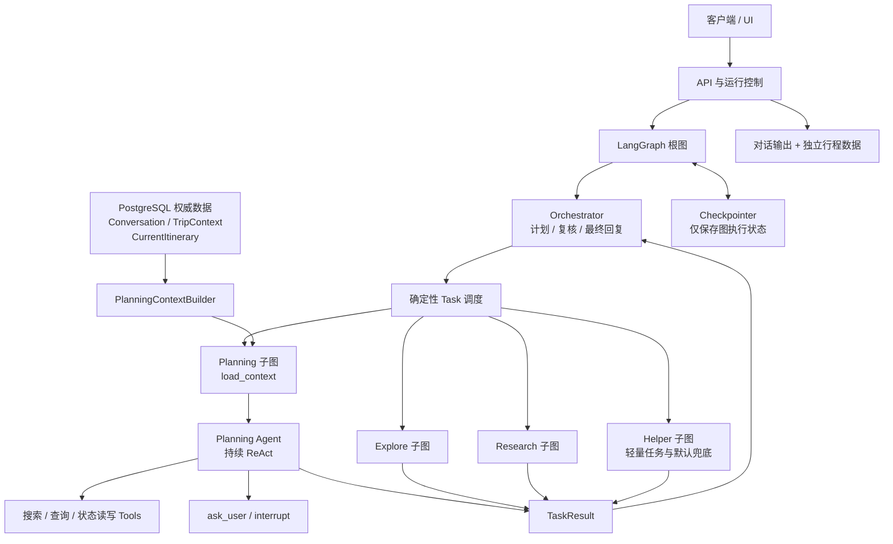
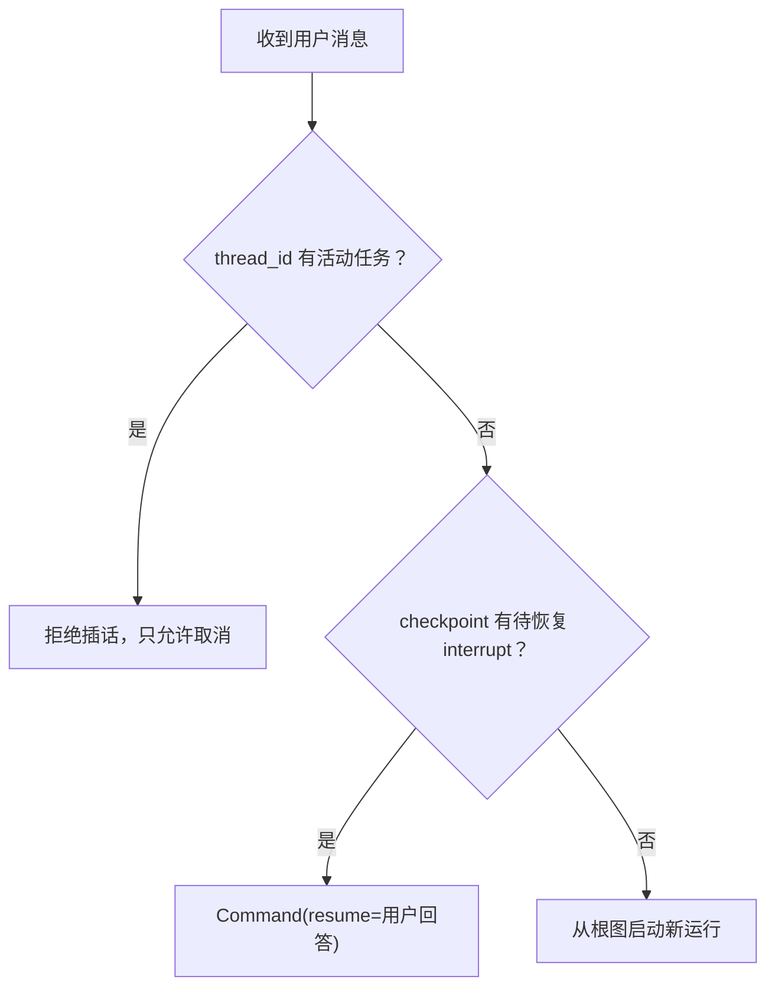

# 旅行 Agent 项目架构基线

> 本文记录当前已经确认的项目架构和行为边界，用于指导后续设计与开发。
> 它描述的是稳定方向，不提前规定尚未验证的文件结构、数据库表或第三方服务实现。
> 后续实现如果与本文冲突，应先更新并确认架构，而不是在代码中悄悄引入另一套设计。

相关专题文档：

- `docs/root-graph-guide.md`：根图、运行控制与 Planning 衔接；
- `docs/planning-subgraph-design.md`：Planning 子图结构、ReAct、上下文、记忆和实现边界；
- `docs/explore-subgraph-design.md`：Explore 子图结构、只读探索能力和实现边界；
- `docs/research-subgraph-design.md`：Research 子图规划、调查、综合与修订流程；
- `docs/helper-subgraph-design.md`：Helper 兜底职责、公共只读查询 Tools 和能力边界。

## 1. 项目目标与当前范围

本项目是一个基于 LangGraph 的旅行 Agent，逐步支持旅行灵感、旅行规划、产品搜索，以及后续的预订和订单服务。

项目采用模块化单体起步，优先完成可运行、可测试的垂直链路，不提前建设微服务、通用 Agent 平台或复杂基础设施。

当前优先实现：

```text
用户输入
→ API 根据活动任务与 checkpoint 决定新运行或恢复
→ 根图 Orchestrator 根据当前目标生成受约束的顺序 Task 计划
→ 确定性调度函数进入 Planning、Explore、Research 或 Helper 子图
→ 每个 Task 结束后，Orchestrator 根据 TaskResult 复核并调整剩余计划
→ 如本轮产生或修改行程，用户确认当前方案
→ 确认后写入 CurrentItinerary
→ 后端分别返回对话结果和当前行程
```

真实预订、支付、订单、取消、改签和退款不属于当前实现范围。它们可以成为后续模块，但不能反向增加当前规划模块的复杂度。

## 2. 总体设计原则

### 2.1 根图只编排，不执行领域任务

根图中的 Orchestrator 负责理解用户目标、生成初始 Task 计划、调度业务子图、复核 TaskResult 和
整理最终回复。它不负责旅行规划或调研，不调用领域 Tools，也不修改旅行事实或行程。

Orchestrator 输出受约束的 Task 类型和计划复核决策，随后由普通程序路由到对应模块。LLM 负责
语义决策，程序负责保证任务数量、可用模块和实际跳转目标确定且可检查。

### 2.2 每个业务模块只设置一个 Agent

Planning、未来的 Inspiration、Booking 等模块可以分别拥有自己的 Agent。模块内部不继续拆分 Flight Agent、Hotel Agent、POI Agent 等多层子 Agent，而是把这些能力实现成 Tools 交给模块 Agent 调用。

只有出现当前结构无法解决的真实问题，并经过新的架构确认后，才能增加 Agent 层级。

### 2.3 开放任务使用 ReAct，关键流程使用确定性控制

旅行研究、信息搜索、方案生成和是否需要追问等开放问题，允许 Agent 使用 ReAct 自主判断。

Task 类型校验与实际调度、候选方案确认、CurrentItinerary 写入、金额计算、库存判断、订单状态和未来的支付、预订、取消、退款等关键行为由确定性代码控制。完整方案是否通过候选提交 Tool 交付当前仍由强 Prompt 约束，但候选提交后的确认与写入不再依赖模型判断。

### 2.4 不把开放旅行需求强行固定成字段表

旅行需求具有高度开放性。系统不设计覆盖所有需求的 `TravelRequirements`，也不在进入模块前执行统一的“信息完整性检查”。

Agent 只有在当前任务或当前 Tool 确实无法继续时才向用户提问，即 Just-in-time clarification。

### 2.5 当前事实、当前方案和图执行数据必须分开

`Conversation`、`TripContext`、`CurrentItinerary` 和 `GraphState` 表达不同层次的信息，不能互相替代。尤其不能把 Checkpoint 中的临时消息当成长期业务事实。

## 3. 总体结构



这张图只表达职责关系，不要求每个方框都对应一个类或一个文件。

## 4. 根图设计

### 4.1 Orchestrator

Orchestrator 根据当前用户输入和当前消息之前最近 4 条 Conversation 生成初始顺序计划。近期历史
只用于理解“还是第二个”“把刚才那个换掉”等指代、省略和语义承接；不能为了编排预先加载完整
TripContext 或 CurrentItinerary。

简单请求只生成一个 Task；复合请求可以包含多个 Task。每个 Task 结束后，Orchestrator 根据全部
原始 TaskResult 决定继续、替换剩余计划或结束，并在继续执行时整理一份面向下一 Task 的
`handoff_context`。无法明确归入 Planning、Explore 或 Research 的请求进入 Helper，根图不根据
自己对 Tool 能力的猜测提前拒绝请求。

它不负责：

- 提取一套完整旅行字段；
- 判断全部信息是否完整；
- 调用搜索、行程或记忆 Tools；
- 调用子图内部 Tool 或直接完成业务任务；
- 决定支付、预订等副作用是否执行。

详细 Task 契约、State、RAG 和恢复规则见 `docs/travel_agent_orchestrator_task_design.md`。

### 4.2 确定性 Task 调度

Orchestrator 的 Task 类型必须映射到代码中已经注册的节点。实际 Graph 跳转由条件路由函数完成，
不允许模型任意生成节点名或直接控制系统主流程。

当前保留：

- `planning`：进入旅行规划模块；
- `explore`：进入开放式旅行发现模块；
- `research`：进入深度调研模块；
- `helper`：处理轻量任务，并对其他请求提供兜底回答、能力说明或安全拒绝。

新增 Task 类型应与新增业务模块同时设计，不提前放置大量空路由。当前每次请求最多完成五个
Task，并且只按顺序执行，不构建并行 DAG。

### 4.3 根图与模块 State

根图和模块子图分别使用满足当前职责的最小 State。两者通过明确的输入映射交换数据，不共享一个不断膨胀的万能 State。

根图携带当前请求、可信作用域、待执行 Task、当前 Task、只追加的原始 TaskResult、当前
`handoff_context`、执行计数和对外输出。
消息记录 ID 仅作为子图加载历史时的截止位置，避免当前请求被重复注入；它不是业务 Context。
每个子图在进入后通过自己的 `load_context` 节点和 Context Builder 按需加载业务信息。
根图不会预加载 TripContext 或 CurrentItinerary 作为各子图的上下文，也不转存模块内部 ReAct
messages；但 RootState 会携带子图返回的 `candidate_itinerary` / `current_itinerary`，作为本轮 API
响应的独立输出字段。

为兼容现有消息 API，`route` 字段继续返回最近一次完成或当前中断的 Task 类型；它不再表示整轮
请求只进入过一个模块。

`thread_id` 通过 LangGraph 运行配置传入，不写入 GraphState。

## 5. Planning Agent 设计

Planning 模块内部只有一个 Agent。交通、酒店、景点、天气、路线和其他旅行信息由 Tools 提供，不继续拆成更多 Agent。

Planning Agent 可以：

- 理解用户希望生成、修改或查询的旅行内容；
- 读取完整的当前 `TripContext`；
- 读取当前 `CurrentItinerary`；
- 调用经过处理的搜索或查询 Tools；
- 通过 Tools 增删改查 `TripContext`；
- 在确实缺少继续规划所必需的信息时通过 `ask_user` 提问并暂停；
- 生成或修改方案，并单独调用 `submit_candidate_itinerary` 提交候选方案。

Planning Agent 认为当前方案已经足以满足用户这一次的要求时，可以停止继续扩展。这里的“足够”由 LLM 根据当前请求判断，不要求每次都生成一份覆盖交通、酒店、景点的完整旅行方案。

如果本轮产生或修改了行程，结束前应让用户看到当前候选方案并请求确认；用户确认后写入当前行程。如果只是回答临时问题且不修改行程，则无需调用行程写入 Tool。

ReAct 循环必须限制最大步数、可用 Tool 范围和外部调用超时，避免无界运行。

## 6. 信息与记忆模型

本项目当前只定义四类逻辑信息，不增加跨旅行长期记忆、Draft、版本仓库或通用记忆系统。

| 信息 | 作用 | 更新方式 | 是否权威 |
|---|---|---|---|
| `Conversation` | 保存用户可见的原始对话 | 只追加 | 是，代表原始交流历史 |
| `TripContext` | 保存当前旅行有效的事实和个性化要求 | Agent 通过 Tool 增删改查 | 是，代表当前旅行上下文 |
| `CurrentItinerary` | 保存当前已经确认的行程文本 | 确认后整体写入或替换 | 是，代表当前有效方案 |
| `GraphState` | 保存当前运行的 Task 计划、ReAct 消息、处理后 Tool 结果和中断信息 | 随图运行更新 | 否，只是工作流状态 |

### 6.1 Conversation

`Conversation` 以 raw 形式保存用户可见的历史对话，并保持 append-only：

- 不覆盖旧消息；
- 不提供消息编辑、替换、重发或自动合并能力；
- 不因为当前事实发生变化而修改历史；
- 不保存内部 Thought、完整 Tool 调用轨迹或供应商原始响应；
- 不把完整 `CurrentItinerary` 重复追加为普通 AssistantMessage。

Graph 启动时不把完整历史复制进 GraphState。目标子图固定加载同一旅行中、当前消息之前的最近
8 条原始 Conversation，并根据增强后的检索查询召回当前用户、当前 Trip 最相关的 3 条历史 Chunk。
自动召回结果保存到独立的 `retrieved_history`，不与原始 `conversation_context` 混合；底层 raw
历史始终完整保留。近期 Conversation 中已有的 `exchange_id` 会在数据库检索时排除，并在排除后
先进行向量召回，再经过 `qwen3.7-text-rerank` 评分、阈值过滤和 Chunk Embedding 语义去重，最后
执行 Top K 截断，避免低相关或重复历史占用上下文。历史摘要和动态压缩暂不实现。

### 6.2 TripContext

`TripContext` 是一个动态字典或同等能力的结构化对象，不规定目的地、日期、预算、偏好等固定字段，也不建立封闭枚举。

它可以保存：

- 当前有效的旅行事实；
- 只对当前旅行有效的用户偏好；
- 对当前旅行有效的客制化要求；
- Agent 判断后续任务仍需要使用的信息。

具体键名由 Agent 根据语义维护。每次调用 Planning Agent 时，把完整的当前 `TripContext` 放入模型上下文，使模型能够结合全部内容理解同义键和用户修改。

当前阶段不实现统一字段标准化、同义词注册表或 Schema 迁移系统。键重复、命名不完全一致等风险由 Agent 的上下文理解和 Prompt 约束承担。这是有意接受的 MVP 权衡，不应为了消除理论风险提前引入固定字段体系。

`TripContext` 的修改通过明确的 CRUD Tools 完成，Agent 不直接访问数据库或存储客户端。同一轮
最多执行一个 TripContext 写 Tool；多个更新字段应合并到一次 `update_trip_context` 调用，多个
删除键应合并到一次删除调用，避免并发写入同一个 State 字段。

### 6.3 CurrentItinerary

`CurrentItinerary` 只保存当前有效方案，可以直接使用纯文本或 Markdown，不规定固定的天数、航班、酒店、活动等嵌套字段。

当前阶段明确不提供：

- `DraftItinerary` 业务实体；
- 行程历史版本；
- 自动回滚；
- 方案差异比较；
- 从某个历史版本恢复。

生成中的候选方案可以暂时存在于 GraphState、ReAct 消息或中断载荷中，但它不是独立的持久化业务对象。用户选择“是”后，确定性节点将当前 candidate 写入或替换 CurrentItinerary。

如果用户要求找回旧方案，当前阶段允许 LLM 根据 `Conversation + CurrentItinerary` 尽力重建。该过程可能不精确，这是已经接受的限制；真正的版本控制留到以后作为独立 Tool 设计。

### 6.4 GraphState

GraphState 只服务于正在执行的图，可以包含：

- 本次 Orchestrator 计划、当前 Task、剩余 Task 和 TaskResult；
- Reviewer 根据原始 TaskResult 整理的临时 `handoff_context`；
- Task 执行计数和计划复核决策；
- ReAct 循环使用的 messages；
- 已处理和压缩后的 Tool 结果；
- 当前候选输出；
- interrupt / resume 所需数据；
- 本轮进度和结束结果。

GraphState 可以由 Checkpointer 保存，以支持 Agent 提问后的暂停与恢复，但它仍然不是权威业务存储。取消本次运行后，这些临时信息应被废弃或失效。
当前内存 Checkpointer 只保留等待 interrupt 恢复的运行；API 正常返回完整结果后删除对应
`thread_id` 的 checkpoint，避免已完成运行的历史状态持续占用进程内存。

密钥、模型客户端、数据库连接、HTTP 客户端和其他运行时依赖不得放入 GraphState。

## 7. Context Builder

项目采用“根图最小上下文、子图按需加载”的原则。API 不在进入根图前一次性加载所有业务 Context，根图也不把所有长期数据分发给各模块。调度当前 Task 后，目标子图执行自己的 `load_context` 节点，并通过模块专属 Context Builder、Repository 和 PostgreSQL 读取所需信息。

```text
API
→ 根图：user_id + trip_id + 当前请求 + 当前消息记录 ID
→ Orchestrator 计划与确定性 Task 调度
→ 目标子图 load_context
→ 模块 Context Builder
→ Repository
→ PostgreSQL
→ 构造模块 State
```

Planning Agent 的模型上下文在调用前动态组装，持久化数据和 Prompt 表达分离。它通常由以下部分组成：

| 数据 | 当前加载策略 |
|---|---|
| `TripContext` | 全量加载并注入模型上下文 |
| `CurrentItinerary` | 存在时全量加载并注入模型上下文 |
| `Conversation` | 只加载当前消息之前最近 8 条，以历史 HumanMessage / AIMessage 形式提供 |
| `RetrievedHistory` | 根据增强后的专用查询召回 Top 3，以独立的相关历史分区提供 |

```text
模块 System Prompt
+ 当前旅行最近 8 条 Conversation
+ 语义召回的相关历史
+ 完整 TripContext
+ CurrentItinerary（如果存在）
+ 当前 GraphState 中必要的 ReAct 消息
+ 当前步骤所需的已处理 Tool 结果
```

根图在 `create_plan` 之前通过独立的 `load_orchestrator_context` 节点读取当前消息之前最近 4 条
Conversation。Orchestrator Prompt 和实际模型消息都必须明确标注【历史消息】与【当前消息】：
历史只用于消解指代和承接语义，计划只服务于最后的当前消息。这不等于让根图加载完整模块
Context；TripContext 和 CurrentItinerary 仍由当前 Task 的目标子图按需加载。

根图给子图传递两份职责不同的文本：执行消息包含原始用户目标、当前 Task 和 Reviewer 整理的
`handoff_context`；`retrieval_query` 则以当前检索目标为主，补充用户总体目标和已有结果，仅用于
自动历史召回。根图正常路径始终提供专用查询；子图被单独调用时可回退使用当前执行消息。
完整原始 TaskResult 不直接复制给下游 Agent，也不参与自动 RAG 查询。

实际生成查询向量前，语义增强 Service 使用当前用户输入、当前 Task 目标、`retrieval_query` 和
当前消息之前最近 4 条 Conversation，生成完整独立的增强查询；Embedding 只处理增强结果。Chunk
提交也先使用当前 Exchange、上下文目标和最近 4 条历史生成增强 `retrieval_text`，不在 Chunk 中
复制原始对话。正常结束使用 `orchestration_goal`，interrupt 使用当前 Task 目标。增强 Service
复用当前聊天模型配置，但不作为 Agent、Tool 或 LangGraph 节点运行。

初步向量召回与最终返回数量分离：Repository 默认取得 20 条候选，Reranker 对增强查询与候选
`retrieval_text` 统一评分，Service 先过滤低分结果，再按分数从高到低做贪心语义去重，最后返回
调用方要求的 Top K。Reranker 固定使用 `qwen3.7-text-rerank` 并复用现有模型 API Key；分数阈值、
去重阈值和候选数通过环境变量调整，不写入 GraphState。

未来如果引入其他模块，每个子图都在进入后加载自己的最小上下文。例如 Inspiration 不必加载完整 CurrentItinerary，Booking 只加载交易所需的已选方案和确认状态。各模块仍读取同一份权威业务数据；这里的 Scoped Context 是读取和投影策略，不意味着复制多份互相独立的业务状态。

数据库连接池、Repository、模型客户端、召回 Service 和其他运行时依赖通过构图参数、运行时
Context 或应用依赖注入提供，不能写入 RootState 或模块 State。Planning、Explore、Research 和
Helper 均可调用 `search_conversation_history` 搜索派生检索文本，并在需要精确原话时调用
`read_conversation_exchanges`；两个 Tool 的用户和 Trip 作用域来自 `ToolRuntime.state`，模型
不能自行指定。

Conversation 的追加由 API 或应用服务统一负责：接受请求后保存用户可见的 user message，
Orchestrator 正常结束后保存最终用户可见的 assistant message。TaskSpec、TaskResult、子图调用用的
内部 HumanMessage、SystemMessage、ToolMessage、Tool Call 和内部轨迹均不得写入长期
Conversation，也不得单独生成 RAG Chunk。`handoff_context` 和 `retrieval_query` 同样只是当前
Graph 运行的临时派生数据，不写入数据库。

interrupt 恢复时沿用 checkpoint 中已有的 `retrieved_history`，不重新进入 `load_context`。后续
只在真实需要时增加历史摘要；TripContext 和 CurrentItinerary 继续保持全量加载，
不通过召回 Tool 获取。

## 8. 用户提问、暂停与取消

用户是否可以发送消息由 API 和 UI 控制，不由 LLM 判断。

### 8.1 消息请求幂等性

客户端每次调用 `POST /messages` 时必须生成新的 UUID 作为 `idempotency_id`。后端在运行
根图之前用该 ID 原子认领请求，并在 PostgreSQL 中保存请求作用域、请求指纹、处理状态和
最终 HTTP 响应。`idempotency_id` 不写入 GraphState，也不代替 `thread_id`：前者标识一次
HTTP 消息请求，后者标识同一旅行的 LangGraph 执行线程。

重复请求按以下规则处理：

- 同一 ID、同一请求仍处于 `processing` 时，返回 `202` 和 `processing`，不重复运行图；
- 同一 ID、同一请求已经进入 `completed`、`failed` 或 `cancelled` 终态时，原样重放首次
  保存的 HTTP 状态码和 JSON 响应；
- 同一 ID 被用于不同的 `user_id`、`trip_id` 或消息内容时，返回 `409`；
- Agent 产生 interrupt 后，本次 HTTP 请求已经完成，因此候选方案或提问响应以
  `completed` 保存；用户回答 interrupt 时必须使用新的 `idempotency_id`。

缓存成功响应必须发生在正常 checkpoint 清理之前。这样即使客户端没有收到响应并重试，
后端也会重放结果，而不会因为 checkpoint 已删除而重新执行根图和业务写入。当前仍是单进程
内存 Checkpointer；进程异常退出时遗留的 `processing` 记录暂不自动接管，后续引入持久化
Checkpointer 或多实例部署时再设计带租约的超时恢复。

### 8.2 运行控制

该交互规则适用于 Planning 以及未来的其他模块 Agent，不为某个模块单独实现“运行中插话”。

`IDLE / RUNNING / WAITING_USER` 只适合描述交互现象，不能再维护为一份独立状态。API
直接依据两个运行事实决定行为：当前 `thread_id` 是否存在活动任务，以及 Checkpointer 是否
存在待恢复的 interrupt。



同一 `thread_id` 使用进程内锁保护“检查并启动”的原子边界，直接调用 API 也不能绕过。
不同 `thread_id` 使用不同锁，可以并发运行。当前 API 以 `trip_id` 的字符串形式作为
`thread_id`，后续只有出现一次旅行需要多个独立运行线程的真实需求时才拆分二者。

取消属于运行控制指令，不作为 HumanMessage 发送给 LLM，也不追加到 Conversation。取消后：

- 停止当前运行；
- 丢弃未完成的 ReAct 轨迹、临时 Tool 结果和候选输出；
- 不把未完成的 Assistant 流式输出提交到 Conversation；
- 下一条用户消息从根图重新进入，不恢复被取消的模块子图。

取消只阻止尚未发生的后续执行，不撤销、回滚或补偿已经开始或完成的 DB 写入、Tool 调用及外部系统操作；这些副作用保持其实际结果。客户端应在用户取消前明确提示这一限制。

被取消请求的原始用户输入继续保留在 Conversation，不能编辑或替换。取消完成后，用户只能另行发送一条新消息；后端按普通消息追加，不提供 `replace`、`resubmit` 等特殊模式，也不自动拼接旧消息。下一次运行可以从近期 Conversation 自然看到两条独立消息，用户应在新消息中明确说明需要修正的内容。

只有 checkpoint 中确实存在待恢复 interrupt 时，用户回答才使用 `Command(resume=...)`；
取消后的新输入必须被视为一次新的根图运行。

## 9. 行程确认、写入与输出

### 9.1 确认与写入条件

Planning Agent 只能通过 `submit_candidate_itinerary` 提交完整候选方案，不能直接写入 CurrentItinerary。候选方案先更新 GraphState，再由独立确认节点执行 interrupt；该节点只接受“是”或“否”。

用户选择“是”后，确定性节点把 State 中的 candidate 写入数据库，并同步更新 `current_itinerary`、清空 candidate。用户选择“否”时不写数据库，清空待展示 candidate，并把拒绝结果返回 Agent 继续询问必要的修改信息。完整方案必须使用提交 Tool 的要求继续采用强 Prompt 约束，当前不增加自然语言输出识别节点。

### 9.2 输出通道

完整 `CurrentItinerary` 不由 LLM 再作为普通聊天文本复述。后端响应或流式事件将内容分成两个通道，例如：

```text
assistant_message     简短的自然语言说明或确认提示
current_itinerary     后端读取并返回的当前行程内容
```

Conversation 只记录必要的用户可见对话，不重复存入大段行程文本。客户端可以把 `current_itinerary` 渲染成独立的行程区域或卡片。

用户确认前需要查看的候选方案同样可以通过独立的结构化输出或中断载荷展示，但不因此创建持久化 Draft 实体。

## 10. Tools 设计边界

Tools 是模块 Agent 与外部能力或业务状态交互的唯一边界。

当前 Planning Agent 的 Tools 大致分为：

- 旅行信息搜索与查询 Tools；
- `TripContext` CRUD Tools；
- Agent 主动提问所需的 `ask_user` 能力；
- 提交候选方案的 `submit_candidate_itinerary`。

Tool 返回给 Agent 的数据必须在边界处完成筛选、规范化和压缩：

- 不把供应商原始响应整体塞入 GraphState；
- 只保留当前决策所需信息；
- 保留必要的来源标识、时间和关键业务值；
- 不把 Tool 结果追加到长期 Conversation。

当前只读网络查询在供应商 Client 边界处理小幅网络抖动，首次失败后最多重试两次。重试只
覆盖连接、超时、协议中断和明确的临时 HTTP 状态，不放在 LangGraph 节点或整个 ToolNode
上。当前阶段不静默吞掉外部服务故障；重试耗尽后原异常继续向上抛出，便于开发调试。

`ask_user` 和 `submit_candidate_itinerary` 必须独占一轮 Tool 调用；独立确认节点也不得与其他节点并行执行。当前搜索类 Tools 默认只读。未来预订、支付、取消和退款等副作用必须置于确定性工作流之后。

## 11. 持久化边界

逻辑持久化分为两类：

### 11.1 业务信息

`Conversation`、`TripContext` 和 `CurrentItinerary` 是业务层需要长期保存的权威信息。当前使用 PostgreSQL 作为事实来源，通过模块 Repository 访问；Context Builder 负责选择并组装本轮需要的快照，不直接编写 SQL。

### 11.2 图运行状态

Checkpointer 保存 GraphState，用于：

- 同一 `thread_id` 下的图状态隔离；
- Agent 提问后的 interrupt / resume；
- 开发阶段的状态检查和恢复。

Checkpointer 中的数据不能替代业务信息持久化。开发测试可以使用内存实现；生产技术选型不在当前阶段提前确定。

## 12. 典型运行流程

### 12.1 Orchestrator 执行旅行规划

```text
用户提交请求
→ API 确认当前会话可接收输入
→ Conversation 追加用户原始消息
→ Orchestrator 根据当前目标和少量近期历史生成 1～5 个顺序 Task
→ 程序取得当前 Task 并按受约束的 task_type 调度目标子图
→ 目标子图自行加载所需 Context，并完成 ReAct、主动提问或其他模块流程
→ 子图结束后返回 TaskResult
→ Orchestrator 根据 TaskResult 继续、替换剩余计划或结束
→ 如果进入 Planning 并形成候选方案，沿用 submit_candidate_itinerary 和 interrupt 确认
→ 用户确认后由确定性节点写入 CurrentItinerary
→ Orchestrator 综合本轮有效结果生成最终 assistant_message
→ 后端分别返回 assistant_message、candidate_itinerary 和 current_itinerary 中适用的字段
→ 本轮结束
```

### 12.2 取消后发送新请求

```text
Planning Agent 正在运行
→ 用户点击取消
→ API 终止当前运行并废弃临时 GraphState
→ 已经开始或完成的业务副作用保持原状
→ 用户另行发送一条新消息，明确说明新的要求
→ 新消息追加到原 Conversation
→ 从根图重新生成 Task 计划并调度
→ LLM 从近期 Conversation 看到彼此独立的旧消息和新消息
```

### 12.3 临时旅行查询

```text
用户询问当前酒店附近的某类设施
→ Orchestrator 生成包含 Planning 的 Task
→ Agent 使用当前上下文调用 POI 查询 Tool
→ 返回查询结果
→ 如果问题不改变长期旅行事实，则不修改 TripContext
→ 如果问题不改变行程，则不提交 candidate，也不进入确认与写入节点
```

## 13. 当前不实现的内容

为了防止架构无止境扩展，当前不实现：

- 模块内部的多级 Agent；
- 固定字段式的完整旅行需求模型；
- TripContext 同义词注册表和通用 Schema 系统；
- DraftItinerary 和行程历史版本；
- 自动从历史精确恢复旧行程；
- 用户运行中插话、抢占、已发送消息编辑和请求自动合并；
- 一开始就建设复杂的长对话 RAG 平台、动态摘要流水线和自动遗忘机制；
- 微服务、消息总线、复杂缓存和通用工作流平台；
- 真实预订、支付、订单和退改签实现；
- 生产数据库、部署和高可用方案。

新增以上能力时，应先用真实需求说明它解决的问题，再更新本文并进入相应实现阶段。

## 14. 后续开发检查清单

后续设计或代码评审时，至少检查以下问题：

1. Orchestrator 是否仍然只负责任务计划、调度、复核和最终回复，而没有调用领域 Tool 或修改业务数据？
2. 新能力应当是 Tool，还是确实有理由成为新的模块 Agent？
3. 是否错误地把 GraphState 当成长期业务事实？
4. 是否给 TripContext 增加了未经确认的固定字段体系？
5. 是否引入了 Draft、版本控制或其他当前明确不需要的能力？
6. 运行中的用户输入是否由 API 阻止，而不是交给 LLM 自行处理？
7. 完整行程是否通过后端独立字段返回，而不是重复污染 Conversation？
8. Tool 结果是否已经压缩和规范化后才进入模型上下文？
9. 候选确认与 CurrentItinerary 写入是否仍由确定性节点控制？
10. 交易类副作用是否仍由未来的确定性工作流控制？
11. 内部 Task、TaskResult 和子图调用消息是否仍未写入 Conversation 或单独生成 RAG Chunk？
