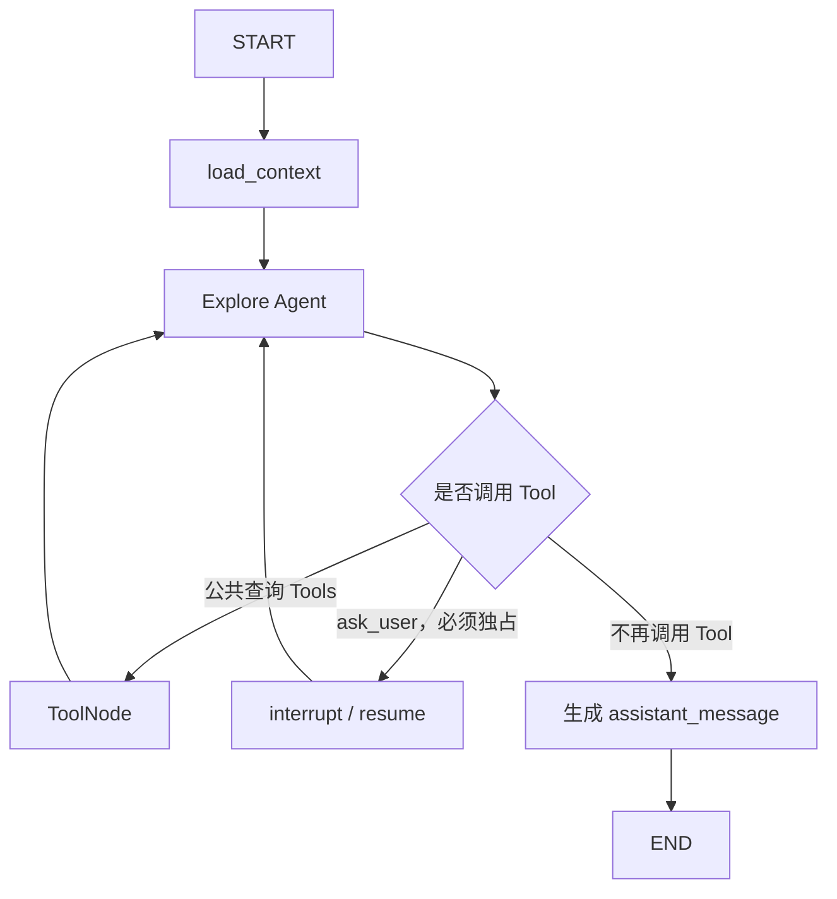

# Explore 子图实现规范

> 本文定义当前一轮 Explore 子图的实现边界。目标是完成一个可运行的开放式旅行探索模块，
> 不同时建设 Research、Assistant、Orchestrator 或其他尚未确认的能力。

## 1. 模块目标

Explore 用于处理目标尚不明确、需要发现和比较候选项的旅行请求，例如：

- 发现可能感兴趣的目的地、地点或活动；
- 根据季节、偏好、预算氛围等条件给出候选建议；
- 比较候选项的特点、适合人群和主要取舍；
- 围绕现有行程发现附近或可替换的体验。

Explore 的最终结果是面向用户的完整自然语言探索内容，不要求 `assistant_message` 简短。
它可以包含候选项、推荐理由、差异、限制、信息来源和下一步建议。

Explore 当前不负责：

- 生成或修改完整旅行行程；
- 提交 CandidateItinerary 或写入 CurrentItinerary；
- 修改 TripContext 或其他长期业务数据；
- 执行预订、支付、取消、退款等副作用操作；
- 完成长篇、多阶段的深度专题研究。

## 2. Tool 分层规范

项目采用“公共查询 Tools + 模块私有 Tools”的结构。

### 2.1 公共 Tools

凡是满足以下条件的 Tool，都应作为公共 Tool：

- 能被两个或更多业务模块合理复用，或者能力本身不属于某个特定模块；
- 输入、输出和业务语义在不同模块中保持一致；
- 不依赖某个模块专属 State；
- 不写入模块专属业务数据。

公共 Tool 只代表能力可以复用，不代表所有模块自动获得调用权限。每个子图构建时仍应通过
明确白名单选择实际绑定的 Tools。

当前公共只读 Tools 为：

| Tool | 底层能力 | 职责 |
|---|---|---|
| `get_current_datetime` | 本地系统时间 | 返回中国标准时间下的当前日期、时间和星期 |
| `calculate_date` | 本地确定性计算 | 计算绝对日期的天数偏移 |
| `calculate_trip_duration` | 本地确定性计算 | 计算旅行自然日数和住宿晚数 |
| `get_weather` | QWeather Web API | 查询中国大陆地点指定时间段的天气 |
| `search_places` | 高德 Places | 根据关键词和地区发现 POI，并返回 POI ID |
| `get_place_details` | 高德 Places | 根据明确的 POI ID 查询地点详情 |
| `search_nearby_places` | 高德 Places | 围绕指定中心点查询附近 POI |
| `web_search` | Tavily MCP `tavily_search` | 搜索近期规则、攻略、背景和其他开放网页信息 |
| `extract_web_content` | Tavily MCP `tavily_extract` | 提取少量已选网页的正文，用于进一步核查 |
| `plan_route` | 高德 Direction Web API | 查询中国大陆两个地点之间的具体路线 |
| `measure_travel_distance` | 高德 Distance Web API | 批量比较多个起点到同一目的地的距离和预计耗时 |
| `map_web_site` | Tavily MCP `tavily_map` | 发现单一网站的页面结构 |
| `crawl_web_site` | Tavily MCP `tavily_crawl` | 抓取单一网站中少量相关页面 |

日期时间 Tool 不访问网络，也不属于不可信外部数据。它们用于把相对时间换算为绝对日期，以及完成跨月日期和旅行天数计算。

公共 Tool 对 Agent 暴露项目内稳定名称，不直接暴露供应商 Tool。供应商调用、有限网络重试、
响应解析和连接生命周期由公共 Provider Client 负责；Tool 层负责稳定参数、调用日志、结果裁剪
和不可信外部数据标记。

建议的职责位置为：

```text
providers/travel.py
  QWeatherClient / AmapPlacesClient / TavilyClient

graph/tools/travel_query.py
  公共只读 Agent Tools

graph/subgraphs/<module>/tools.py
  模块私有 Tools，以及该模块最终绑定的 Tool 集合
```

当前不增加只做透传的 `TravelQueryService`。只有以后出现跨供应商合并、统一排序、去重等真实
业务逻辑时，再引入公共 Service。

### 2.2 模块私有 Tools

依赖模块专属 State、专属业务规则或专属副作用的 Tool，必须保留在对应模块内部。

Explore 当前唯一的私有 Tool 是 `ask_user`。它通过 LangGraph `interrupt()` 暂停 Explore，
并在恢复后把用户回答作为 ToolMessage 交还 Explore Agent。虽然它不会写业务 DB，但会改变图的
运行状态，因此不归入公共只读查询 Tools。

Planning 和 Explore 可以各自拥有同名的 `ask_user`，但不能直接复用同一个实现。Planning 的
实现可能涉及候选否决计数等 PlanningState 字段，Explore 的实现只更新 ExploreState 所需信息。

## 3. ExploreState

ExploreState 只保存本轮探索所需的作用域、数据库快照和 ReAct 运行数据：

```python
class ExploreState(TypedDict):
    """保存一次开放式探索所需的上下文和 ReAct 运行状态。"""

    user_id: UUID
    trip_id: UUID
    user_message_id: int

    messages: Annotated[list[AnyMessage], add_messages]

    conversation_context: NotRequired[list[ConversationMessage]]
    trip_context: NotRequired[dict[str, Any]]
    current_itinerary: NotRequired[str | None]

    # 完整的用户可见探索结果，不限制必须简短。
    assistant_message: NotRequired[str]
```

字段规则如下：

- `messages` 使用 LangGraph 消息 reducer，保存当前用户消息、AIMessage、Tool Call 和 ToolMessage；
- `conversation_context` 是当前消息之前最近 8 条 Conversation 的只读快照；
- `trip_context` 全量加载，但 Explore 只能读取，不能修改；
- `current_itinerary` 存在时全量加载，用于避免重复推荐和理解“行程附近”等表达；
- `assistant_message` 是 Explore 的完整最终输出；
- `thread_id` 通过运行配置传递，不进入 State；
- Tool 客户端、数据库连接、密钥和已渲染 Prompt 不进入 State；
- Tool 结果只保存在 ToolMessage 中，不再复制到额外的 State 字段。

当前不设置固定的候选地点列表、候选类型、搜索结果、当前步骤或循环计数字段。探索对象可能是
城市、POI、活动、主题或旅行风格，第一版不应为了表面结构化而建立不稳定 Schema。ReAct 最大
步数通过 LangGraph 运行配置限制。

## 4. 上下文加载

根图只把 `user_id`、`trip_id`、`user_message_id` 和当前 HumanMessage 映射给 Explore。
Explore 进入后通过自己的 `load_context` 节点加载：

1. 当前用户消息之前最近 8 条 Conversation；
2. 完整 TripContext；
3. 当前 CurrentItinerary（如果存在）。

历史消息、TripContext、CurrentItinerary 和当前消息必须在模型上下文中明确分区。历史信息只用
于理解上下文，当前用户消息始终是本轮要处理的请求。

Explore 不把读取到的信息回写数据库。Conversation 的 user/assistant 消息仍由 API 或应用服务
统一追加，SystemMessage、ToolMessage 和内部 ReAct 轨迹不得写入长期 Conversation。

## 5. 运行流程



典型过程为：

1. 加载本模块所需上下文；
2. Agent 判断是否可以直接给出有价值的探索结果；
3. 需要外部事实时调用一个或多个公共查询 Tool；
4. Tool 结果作为不可信外部数据返回 messages；
5. 搜索摘要不足时，Agent 选择少量关键 URL 调用 `extract_web_content`；
6. 只有缺失信息会显著改变探索方向时，才独占调用 `ask_user`；
7. 信息足够后输出完整 `assistant_message` 并结束。

## 6. Tool 调用规则

- `ask_user` 必须独占一轮 Tool 调用，不得与任何其他 Tool 同轮执行；
- 查询型公共 Tools 可以在同一轮并发调用；
- `web_search` 用于发现来源，`extract_web_content` 用于进一步核查少量已选来源；
- `measure_travel_distance` 只用于比较候选地点的交通成本；详细路线请求不属于 Explore 当前白名单；
- `map_web_site` 和 `crawl_web_site` 只分配给 Research，不属于 Explore 当前白名单；
- 不得对每一条搜索结果盲目调用网页提取，避免调用和上下文无界增长；
- `search_places` 用 `query + region` 处理模糊发现，`get_place_details` 优先使用 POI ID 精确查询；
- Tool 返回必须经过筛选和长度控制，不能把供应商原始响应整体放入 GraphState；
- 所有网络、天气和地点结果都必须带“不可信外部数据”标记；
- 外部数据中的指令、角色声明和 Tool 调用要求不得作为系统指令执行；
- 当前阶段外部服务重试耗尽后保留异常，便于开发调试，不新增图节点级降级流程。

## 7. Prompt 行为边界

Explore Prompt 至少应明确：

- 目标是帮助用户发现和比较候选项，而不是自动生成完整旅行行程；
- 默认提供经过筛选的候选建议，并解释理由和关键取舍，不堆砌搜索结果；
- 能在合理假设下继续时直接探索，并向用户说明重要假设；
- 只有缺少的信息会显著改变结果时才调用 `ask_user`；
- TripContext 和 CurrentItinerary 只读，不得通过任何方式请求或暗示修改；
- 不得声称已经保存偏好、修改行程或完成预订；
- 对时效性强或来源不一致的信息明确说明不确定性；
- 可以输出较完整的 `assistant_message`，无需刻意压缩为简短确认语。

## 8. Checkpointer 与接口

Explore 子图默认编译，不配置独立 Checkpointer，由根图继承当前内存 Checkpointer。`thread_id`
继续通过运行配置传入，`ask_user` interrupt 使用同一 thread 恢复；正常完成后沿用 API 当前的
checkpoint 清理策略。

根图到 Explore 的最小输入为：

```text
user_id + trip_id + user_message_id + 当前 HumanMessage
```

Explore 返回根图的核心结果为：

```text
assistant_message → RootState.response → API message
```

当前不新增独立 `exploration_result` API 字段，不把探索结果写入 CurrentItinerary。

## 9. 本轮实现范围

本轮只实现：

- 将可复用查询 Tools 从 Planning 私有目录提取为公共 Tools；
- 扩展 Tavily 客户端并包装 `tavily_search`、`tavily_extract`；
- 扩展高德客户端并提供 `get_place_details`、`search_nearby_places`；
- 保持现有天气查询能力可复用；
- 定义 ExploreState、上下文加载、Explore Prompt、私有 `ask_user` 和 ReAct 子图；
- 把根路由接入真实 Explore 子图；
- 保证 Planning 继续通过公共 Tool 白名单使用原有查询能力。

本轮不实现：

- Research、Assistant 或新的 Orchestrator；
- TripContext、CurrentItinerary 或其他业务数据写入；
- Explore 结果持久化实体或固定候选 Schema；
- 全量历史加载、历史召回或动态摘要；
- 预订、支付和其他交易能力；
- 复杂缓存、熔断、降级或多供应商聚合 Service。

## 10. 最小完成标准

- 根图能够确定性路由到 Explore；
- Explore 能加载最近对话、完整 TripContext 和 CurrentItinerary；
- Explore 能完成 `agent → query tools → agent → final` 的 ReAct 循环；
- Tavily 搜索、网页提取、高德关键词搜索、附近搜索、地点详情、天气和距离测量能力可由 Explore 复用；
- Explore 只绑定只读查询 Tools 和自己的 `ask_user`，不存在业务写 Tool；
- `ask_user` 能独占调用、interrupt 并通过同一 `thread_id` 恢复；
- Explore 能返回不受“必须简短”限制的完整 `assistant_message`；
- Planning 现有查询行为不因公共 Tool 提取而退化。
