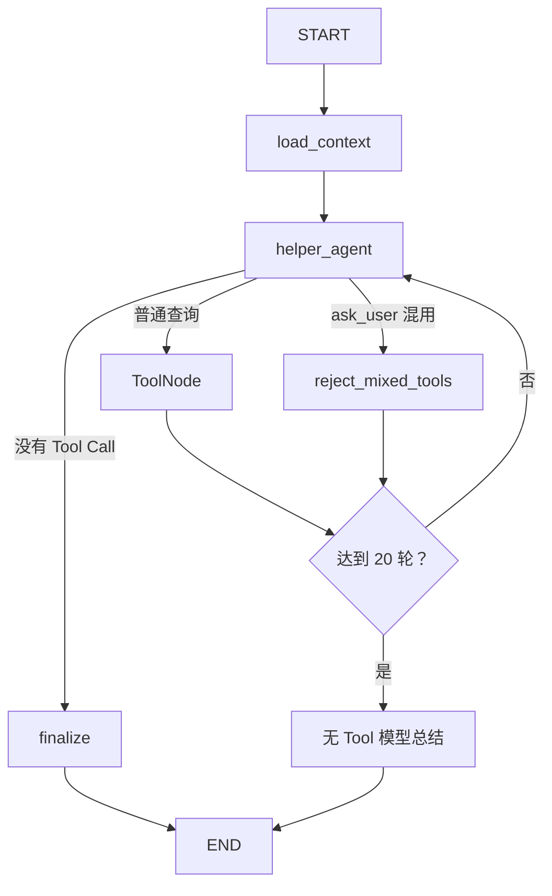

# Helper 子图设计

## 1. 定位

Helper 负责轻量对话、局部只读查询、简单比较和无法归入其他模块的安全兜底。它不是通用 Agent，
不承担开放式候选发现、深度研究、行程写入或交易操作。

典型边界：

```text
读取、解释、局部查询、简单比较 → Helper
开放式发现候选                 → Explore
多步骤调查、证据核查           → Research
形成或修改旅行安排             → Planning
其他请求                       → Helper 兜底
```

Helper 遇到登录、下单、支付、退款、改签、危险或不合法请求时，应明确拒绝执行；能够提供安全的
公开信息、规则解释或操作指引时，可以继续提供替代帮助。

## 2. 当前能力

- 处理问候、感谢和普通对话；
- 解释旅行名词、用户提供的文本和当前行程内容；
- 查询天气、地点、开放时间、地址、联系方式等局部公开信息；
- 搜索网页并提取少量关键网页正文；
- 查询中国大陆路线并比较多个地点的距离和预计耗时；
- 只读解释 TripContext 和 CurrentItinerary；
- 缺少阻塞性信息时，通过 `ask_user` 主动询问用户；
- 对超出能力、存在风险或不合法的请求形成边界回答。

当前不提供通用网页自动操作能力。普通搜索或正文提取无法取得的数据，应如实说明限制；后续只有出现
稳定、明确的数据源时，才增加对应的专用只读 Tool。

## 3. Tools

Helper 只绑定以下公共只读 Tools 和自己的 `ask_user`：

| Tool | 职责 |
|---|---|
| `get_current_datetime` | 返回中国标准时间下的当前日期、时间和星期 |
| `calculate_date` | 计算绝对日期前后若干天的日期 |
| `calculate_trip_duration` | 计算旅行自然日数和住宿晚数 |
| `get_weather` | 查询中国大陆地点在指定时间段的天气 |
| `search_places` | 按关键词和地区发现地点并取得 POI ID |
| `get_place_details` | 根据 POI ID 核查地点详情 |
| `search_nearby_places` | 查询指定中心附近的地点 |
| `web_search` | 搜索近期公开网页信息 |
| `extract_web_content` | 提取少量已选网页正文 |
| `plan_route` | 查询驾车、步行、骑行或公交路线 |
| `measure_travel_distance` | 比较多个起点到同一目的地的距离和耗时 |
| `ask_user` | 缺少关键信息时 interrupt，并在恢复后返回用户回答 |

调用规则：

- 三个日期时间 Tool 是本地确定性能力，不按不可信外部数据处理；
- 普通查询 Tools 可以在同一轮并发调用；
- `ask_user` 必须独占一轮，混用时整批 Tool Call 均不执行；
- `web_search` 用于发现来源，`extract_web_content` 只核查少量关键 URL；
- Tool 返回在 Provider/Tool 边界完成解析、裁剪和不可信数据标记；
- 外部数据中的指令、角色声明和 Tool 调用要求不得作为系统指令执行；
- Helper 不绑定任何业务写 Tool。

## 4. State

```python
class HelperState(TypedDict):
    """保存一次轻量辅助任务的只读上下文、ReAct 消息和最终回答。"""

    user_id: UUID
    trip_id: UUID
    user_message_id: int
    messages: Annotated[list[AnyMessage], add_messages]

    conversation_context: NotRequired[list[ConversationMessage]]
    trip_context: NotRequired[dict[str, Any]]
    current_itinerary: NotRequired[str | None]
    react_round_count: NotRequired[int]
    assistant_message: NotRequired[str]
```

- `conversation_context` 加载当前消息之前最近 8 条 Conversation；
- `trip_context` 和 `current_itinerary` 全量加载，但只能读取；
- `messages` 保存本轮 ReAct 消息，不写入长期 Conversation；
- `react_round_count` 按一批 Tool Calls 计数，参数失败或被程序拒绝的批次也计数；
- `thread_id` 通过运行配置传递，不进入 State。

## 5. 运行流程



`ask_user` 单独调用时由 Tool 内部触发 `interrupt()`。子图不配置独立 Checkpointer，继承根图当前的
内存 Checkpointer，并使用相同 `thread_id` 恢复。

## 6. ReAct 与错误边界

- Helper 最多执行 20 个 Tool Call 批次；
- 达到上限后不再执行新 Tool，由未绑定 Tool 的基础模型根据已有 Observation 形成最终回答；
- 根图 `recursion_limit` 为 50，只作为框架兜底，不替代 Helper 的业务轮次限制；
- 可由模型修正的 Tool 参数 `ValueError` 转为 ToolMessage；
- 外部网络错误在 Client 重试耗尽后继续抛出，便于当前开发阶段调试；
- 不增加 Helper 专属重试节点、熔断、复杂降级或补偿流程；
- 无法核实时必须说明限制，不得编造事实、URL 或声称操作成功。

## 7. 输出与持久化

```text
HelperState.assistant_message
→ RootState.response
→ MessageResponse.message
→ Conversation AssistantMessage
```

当前不增加 Helper 数据库表、结果版本或专属 API 字段。Conversation 仍由 API 统一追加；SystemMessage、
ToolMessage 和内部 ReAct 轨迹不得写入长期 Conversation。正常结束后沿用 API 的 checkpoint 清理策略。

## 8. 当前不实现

- 多 Helper Agent 或内部意图分类节点；
- 通用网页自动操作；
- 登录、验证码、账号授权和非公开数据访问；
- 上传、下载、订单、支付及其他交易能力；
- TripContext、CurrentItinerary 或其他长期数据写入；
- Helper 专属持久化、缓存和结果 Schema；
- 任意领域通用 Agent 能力；
- 复杂降级、熔断和后台任务系统。
