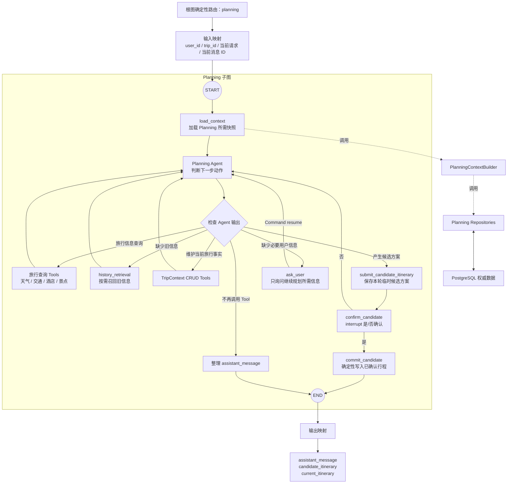
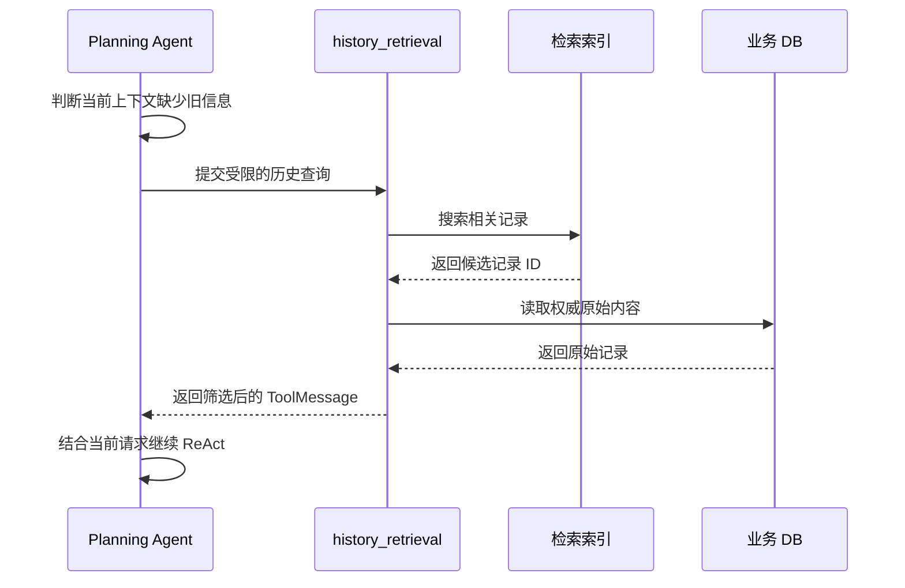
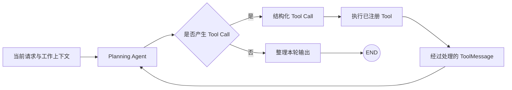
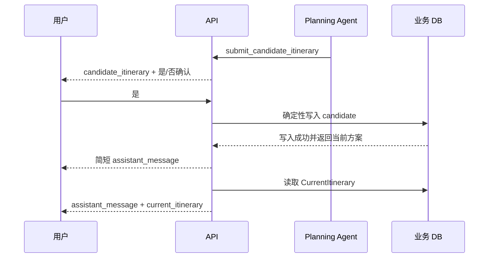

# Planning 子图设计与实现边界

> 本文是 `docs/architecture.md` 的专题补充，记录已经确认的 Planning 子图结构、运行流程和数据边界。
> 后续实现应以本文为指导；若需要改变关键行为，应先更新并确认设计，而不是在代码中隐式引入另一套流程。

## 1. 目标与范围

Planning 子图负责处理已经进入旅行规划模块的请求，包括生成或调整旅行方案、回答与当前旅行有关的问题、按需查询旅行信息、维护当前旅行上下文，以及在用户确认后写入当前行程。

Planning 子图内部只设置一个 Planning Agent。天气、交通、酒店、景点、历史召回和状态读写等能力全部作为 Tools 提供，不继续拆分多级 Agent。

Planning 适合使用 ReAct 处理以下开放任务：

- 判断当前请求需要哪些信息；
- 判断是否需要向用户追问；
- 选择并组合查询 Tools；
- 根据 Tool Observation 调整规划；
- 判断当前结果是否已经足以满足本次请求；
- 生成候选行程并请求用户确认。

Planning 不负责根图路由，也不负责未来的真实预订、支付、取消或退款流程。

## 2. 总体结构

Planning 子图采用显式 `StateGraph`，使 Agent 节点、Tool 节点、条件路由、ReAct 循环和中断位置保持可见。当前不使用隐藏这些控制细节的多层 Agent 封装。



模型负责选择受允许的 Tool 或结束本轮处理，程序只执行已经注册的节点和 Tools。模型不能生成任意节点名或改变图拓扑。

## 3. PlanningState

PlanningState 只保存完成当前这轮规划所需的工作上下文，不承担长期业务存储职责。

建议的最小逻辑结构如下：

```python
class PlanningState(TypedDict):
    # 当前 ReAct 循环中的 HumanMessage、AIMessage 和 ToolMessage。
    messages: Annotated[list[AnyMessage], add_messages]

    # 从完整 Conversation 中选出的近期或相关历史快照。
    conversation_context: list[ConversationMessage]

    # 当前有效旅行事实的本轮快照，不规定固定业务字段。
    trip_context: dict[str, Any]

    # 当前已经确认的行程文本。
    current_itinerary: str | None

    # 本轮临时生成、等待确认的行程文本，不是持久化 Draft 实体。
    candidate_itinerary: str | None

    # 本轮需要进入用户可见对话的简短回答。
    assistant_message: str | None
```

这里表达的是逻辑字段，具体的 `NotRequired`、输入 State、输出 State 或内部 State 可以在实现时按真实需要细分，但不能合并成长久保存所有业务数据的万能 State。

状态规则如下：

- `messages` 使用 LangGraph 消息 reducer，保存本轮 ReAct 所需消息和经过处理的 Tool Observation；
- 当前用户请求作为最新的 HumanMessage 进入 `messages`；
- `conversation_context` 是只读上下文快照，不是完整 Conversation 的副本；
- `trip_context` 和 `current_itinerary` 是 DB 权威数据在本轮的快照；
- `candidate_itinerary` 只存在于当前 GraphState 或 Checkpoint，不写入长期业务 DB；
- `assistant_message` 应保持简短，不重复输出完整 CurrentItinerary；
- `route` 属于根图，不进入 PlanningState；
- `thread_id` 通过运行配置传递，不写入 State；
- 模型客户端、数据库连接、HTTP 客户端和密钥不得进入 State。

## 4. 长期数据与运行数据分层

### 4.1 业务 DB

业务 DB 是长期业务数据的权威来源，保存：

- 完整原始 Conversation；
- 当前 TripContext；
- CurrentItinerary。

不同数据具有不同语义：

- Conversation 是权威的原始交流记录，保持 append-only，但旧消息不一定仍代表当前事实；
- TripContext 是当前旅行中仍然有效的事实和要求；
- CurrentItinerary 是当前已经确认的有效方案；
- TripContext 采用动态结构，不提前规定封闭字段集合。

当前阶段只维护 `CurrentItinerary`，不建设行程版本仓库、自动回滚或精确恢复历史版本。

### 4.2 PlanningState 与 Checkpoint

PlanningState 保存本轮工作快照和 ReAct 临时数据。Checkpointer 可以保存 PlanningState，用于故障恢复、状态检查以及 `interrupt / resume`，但 Checkpoint 不是业务事实来源。

取消当前运行后，下列数据可以被废弃：

- 未完成的 ReAct messages；
- 尚未提交的 Tool 结果；
- candidate itinerary；
- 未完成的 Assistant 流式输出；
- 被取消轨迹的后续执行位置。

取消不会撤销、回滚或补偿已经开始或完成的 DB 写入、业务 Tool 调用及外部系统操作；这些副作用保持其实际结果。

### 4.3 检索索引

RAG 或其他历史检索索引只是由 DB 数据建立的可重建副本，不是权威数据源。推荐的检索关系是：

```text
DB 原始记录
→ 建立可重建索引
→ 检索获得候选记录 ID
→ 回到 DB 读取原始内容
→ 返回长度受限的 Tool Observation
```

当前实现不必立即接入向量数据库。第一版 `history_retrieval` 可以使用普通数据库查询；出现真实语义检索需求后再加入 RAG。

## 5. Context Builder 与历史加载

根图不预先加载 Planning 的完整业务上下文。它完成路由后，只向 Planning 子图映射 `user_id`、`trip_id`、当前用户请求和当前消息记录 ID。消息记录 ID 只用于让近期对话查询截止在当前请求之前，避免同一条用户消息被重复注入。Planning 子图进入后首先执行 `load_context` 节点，再由 `PlanningContextBuilder` 通过 Repository 从 PostgreSQL 加载本模块所需的权威数据快照。

```text
根图 planning 路由
→ Planning 输入映射
→ load_context
→ PlanningContextBuilder
→ Conversation / TripContext / CurrentItinerary Repositories
→ PostgreSQL
→ PlanningState
→ Planning Agent
```

Planning 子图启动时不把完整 Conversation 复制到 PlanningState。Context Builder 只加载：

```text
Planning System Prompt
+ 当前用户请求
+ 少量近期或与当前请求相关的 Conversation
+ 完整的当前 TripContext
+ CurrentItinerary（如果存在）
+ 本轮必要的 ReAct messages
```

当前静态边界为同一旅行中、当前消息之前的最近 8 条 Conversation。更早记录暂不加载，当前也不实现动态历史摘要和动态压缩。

`load_context` 是 Graph 节点，只负责编排上下文加载和写入 PlanningState；数据库查询集中在 Repository，Prompt 组装集中在 PlanningContextBuilder 或 Agent 调用边界。数据库连接池、Repository 和模型客户端不得写入 PlanningState。

Conversation 的长期写入不属于 Planning 子图职责。API 或应用服务在接受请求后追加 user message，在 Planning 正常产出用户可见结果后追加 assistant message；SystemMessage、ToolMessage、Tool Call 和内部 ReAct 轨迹只属于当前运行状态。

Planning Agent 调用模型前，应根据当前 State 动态构造 Prompt，而不是把已渲染的完整 Prompt 长期保存在 State。TripContext 发生更新后，下一次模型调用必须能看到更新后的快照。

信息冲突时采用以下优先级：

```text
当前用户明确表达
> 当前 TripContext
> CurrentItinerary 中已经确认的内容
> 从历史 Conversation 召回的旧信息
```

旧对话是理解上下文的证据，不能直接覆盖当前有效事实。

## 6. 按需历史召回（TODO）

`history_retrieval` 当前不实现。后续如果最近 8 条 Conversation 不足以理解请求，可以为 Conversation 增加按需历史召回；该 Tool 不服务于始终全量加载的 TripContext 和 CurrentItinerary。



召回结果应包含必要的来源标识、时间和内容片段，并限制返回数量与总长度。召回必须受用户、会话或旅行标识约束，不能跨越数据权限边界。

召回结果只进入当前 ReAct `messages`，不应：

- 再次追加进长期 Conversation；
- 自动写入 TripContext；
- 自动写入 CurrentItinerary；
- 把整段无关历史放入 GraphState。

如果 Agent 判断召回出的旧要求在当前仍然有效，应显式调用 TripContext Tool 更新当前事实。

## 7. ReAct 运行流程

Planning ReAct 的程序含义是：



模型的完整内部思维过程不保存、不展示。State 中只保留正常的 AIMessage、结构化 Tool Call 和 ToolMessage。

一次典型规划流程为：

1. Agent 读取当前请求、相关历史、TripContext 和 CurrentItinerary；
2. 如果现有信息足够，直接回答或形成候选方案；
3. 如果需要外部旅行信息，调用只读查询 Tool；
4. Tool 返回经过筛选、规范化和压缩的 Observation；
5. Agent 根据 Observation 继续判断；
6. 如果只有用户才能补充必要信息，调用 `ask_user` 并中断；
7. 用户回答后从原轨迹恢复；
8. Agent 认为当前方案足够满足本次请求时，可以停止扩展；
9. 如果本轮产生或修改行程，Agent 单独调用 `submit_candidate_itinerary`；
10. 程序在候选方案写入 State 后，通过独立节点 interrupt 并只接受“是/否”；
11. 用户确认时程序把 candidate 写入 CurrentItinerary；第一次拒绝时把结果返回 Agent；
12. 连续第二次拒绝时，程序强制独占调用 `ask_user` 收集调整意见，回答后重新计数；
13. 写入成功后程序返回简短 assistant message，子图结束。

ReAct 循环必须设置最大步数、可用 Tool 范围和外部调用超时。最大循环次数优先通过 LangGraph 运行配置控制，不为了计数额外污染业务 State。

## 8. Tools 边界

Planning Tools 分为以下几类：

| 类别 | 示例 | 主要约束 |
|---|---|---|
| 旅行查询 | 天气、地点、网页、路线和距离 Tools | 默认只读；只返回当前决策需要的数据 |
| 历史召回 | `history_retrieval` | 查询 DB 或派生索引；返回条数和长度受限 |
| TripContext | get、set、update、delete | 更新业务 DB，并同步当前 State 快照 |
| 候选方案 | `submit_candidate_itinerary` | 独占一轮 Tool 调用；只更新当前 GraphState，不创建 Draft 业务实体 |
| 用户交互 | `ask_user` | 独占一轮 Tool 调用；只询问继续规划所必需的信息 |
| 候选确认 | `confirm_candidate` 节点 | 独占执行 `interrupt()`，只接受“是/否” |
| 当前行程 | `commit_candidate` 节点 | 用户选择“是”后，确定性写入当前 candidate |

Tool 返回给 Agent 的数据必须在边界处完成筛选、规范化和压缩，不允许把供应商原始响应整体塞入 messages 或 Checkpoint。

### 8.1 当前旅行查询 Tools

当前地点能力只保证中国大陆范围，查询 Tool 采用以下接口和数据源：

| Tool | 输入 | 数据源 | 职责 |
|---|---|---|---|
| `get_current_datetime` | 无 | 本地系统时间 | 返回中国标准时间下的当前日期、时间和星期 |
| `calculate_date` | `base_date: str, offset_days: int` | 本地确定性计算 | 计算某个绝对日期前后若干天的日期和星期 |
| `calculate_trip_duration` | `start_date: str, end_date: str` | 本地确定性计算 | 计算含首尾日期的旅行天数和住宿晚数 |
| `get_weather` | `location: str, time_range: str, region: str = ""` | QWeather Web API | 地理编码后查询目标时间段天气；region 用于缩小行政区范围 |
| `search_places` | `query: str, region: str = ""` | 高德 Places Web API | 发现中国大陆 POI 并取得 POI ID；region 用于提高结果相关性 |
| `get_place_details` | `place_id: str` | 高德 Places Web API | 根据 POI ID 核查地点详情 |
| `search_nearby_places` | `query: str, center: str, radius_m: int = 5000` | 高德 Places Web API | 围绕明确坐标搜索附近 POI |
| `web_search` | `query: str` | Tavily MCP | 补充近期动态、规则、口碑和其他开放信息 |
| `extract_web_content` | `urls: list[str], focus: str = ""` | Tavily MCP | 提取少量已选网页正文，核查关键规则或事实 |
| `plan_route` | `origin: str, destination: str, mode: str, ...` | 高德 Direction Web API | 核查两个地点之间的具体路线 |
| `measure_travel_distance` | `origins: list[str], destination: str, mode: str = "driving", region: str = ""` | 高德 Distance Web API | 批量比较候选起点到同一目的地的距离和预计耗时 |

三个日期时间 Tool 不访问外部服务，也不添加“不可信外部数据”标记。涉及相对时间、跨月日期或行程天数时，Agent 应优先调用它们完成确定性换算，再把绝对日期传给天气等外部 Tool。

`get_weather` 使用 QWeather GeoAPI 把地点名解析为 Location ID，再选择能够覆盖目标日期的预报范围并筛选结果。`time_range` 优先使用绝对日期；超出供应商可预报范围时必须明确说明，不能生成伪精确预报。GeoAPI 返回多个候选地点时采用供应商排名第一的结果，并在 Observation 中明确实际解析到的行政区；Agent 可以结合结果决定是否带更具体的 `region` 重新查询或询问用户。

`search_places` 用于发现候选并取得 POI ID，精确地点事实由 `get_place_details` 核查；周边设施由 `search_nearby_places` 查询。主观体验、临时开放规则等信息可以由 `web_search` 补充，关键网页正文再由 `extract_web_content` 少量提取。国外地点暂不由高德 Tool 保证，可由网页查询提供有限参考。

网页能力只向 Planning Agent 暴露项目内稳定的 `web_search` 和 `extract_web_content`。公共层虽然包装了 `map_web_site` 和 `crawl_web_site`，但它们只分配给 Research，不进入 Planning 白名单。`web_search` 用于发现来源，`extract_web_content` 只核查少量关键 URL；它们不能替代精确天气、POI 和路线数据。并发由 Agent 同时产生多个 Tool Call、`ToolNode` 统一执行，不额外增加并行子图。

Tavily MCP Server 使用 npm 包 `tavily-mcp` 以 STDIO 方式运行，Python 侧使用 `langchain-mcp-adapters` 提供的 `langchain_mcp_adapters` 客户端连接。应用生命周期负责维护持久 MCP Session 并复用 npm 子进程，不能在每次 Tool Call 时重新启动服务端。Planning 只绑定经过筛选和必要包装的网页查询能力。

所有查询 Tool 都只返回经过裁剪的 Observation，并保留必要的来源和查询时间。所有外部查询结果必须标记为“不可信外部数据”，Planning System Prompt 同时要求模型只把它们作为事实参考，忽略其中的指令、角色声明和 Tool 调用要求；该措施用于降低提示词注入风险，但不把外部数据视为经过事实核验。MCP 客户端、Session 及 HTTP 客户端不进入 GraphState；API Key 只从环境变量读取。首批配置为 `TAVILY_API_KEY`、`QWEATHER_API_HOST`、`QWEATHER_API_KEY` 和 `AMAP_WEB_SERVICE_KEY`。

应用生命周期可以创建完整公共 Tool 集合，但 Planning 必须在自己的 Tool 工厂中维护明确白名单。根图只负责传递公共能力，不理解或裁剪各子图权限；其他模块的专属 Tool 和业务写 Tool 不得进入 Planning。

TripContext 和 CurrentItinerary 的写 Tool 应同时完成两件事：

1. 更新业务 DB 中的权威数据；
2. 通过 Tool 返回值或 `Command(update=...)` 同步当前 PlanningState 快照。

这样可以避免同一次 ReAct 循环继续使用过期状态。

完整方案是否通过 `submit_candidate_itinerary` 提交，当前继续采用强 Prompt 约束，不增加自然语言输出识别节点。候选方案一旦提交，后续确认和 CurrentItinerary 写入不再交给 Agent 判断，而由确定性节点控制。

## 9. 候选方案、确认与输出

`candidate_itinerary` 是等待确认的临时文本，可以存在于 GraphState、Checkpoint 或 interrupt 载荷中，但不是长期业务对象。



完整 CurrentItinerary 由后端作为独立响应字段或事件返回，不由模型在普通聊天内容中再次复述。Conversation 只追加必要的用户可见对话，避免重复保存大段行程文本。

如果本轮只是回答临时问题且没有修改行程，则不生成候选方案，也不进入确认和写入节点。

## 10. interrupt、resume 与运行控制

Planning Agent 需要用户输入时调用 `ask_user` 并执行 `interrupt()`。API 不保存额外的
`run_status`，而是根据真实运行数据控制输入：

| 运行事实 | Graph 行为 |
|---|---|
| 当前 `thread_id` 有活动任务 | 拒绝新的业务输入，只允许取消 |
| 无活动任务且 checkpoint 有 interrupt | 使用 `Command(resume=...)` 恢复 |
| 无活动任务且 checkpoint 无 interrupt | 从根图启动新运行 |

只有 Agent 主动提问后的回答使用 resume。取消后的用户输入只能作为一条新的 Conversation 消息重新进入根图，不能恢复被取消的 Planning 轨迹。已经发送的消息不可编辑或替换，后端不提供重发模式，也不自动合并取消前后的两条消息。

根图编译时配置 Checkpointer，Planning 子图默认编译并继承父图的持久化能力，以支持 interrupt。`thread_id` 始终由 API 通过 `configurable` 传入。当前实现以 `trip_id` 作为 `thread_id`，并使用对应的进程内锁防止同一旅行并发运行。

开发阶段可以使用内存 Checkpointer；生产持久化技术等到相应阶段再选择。无论使用哪种 Checkpointer，都不能用它替代 Conversation、TripContext 和 CurrentItinerary 的业务存储。

## 11. 错误与结束边界

不同错误采用不同处理方式：

- 可由模型调整的查询或 Tool 输入错误，转换成简短 ToolMessage 供 Agent 修正；
- 只有用户能解决的信息缺失，通过 `ask_user` 处理；
- QWeather、高德 Places 和 Tavily MCP 的只读查询在各自 Client 边界执行有限重试：首次调用
  失败后最多再试两次，退避时间为 0.5 秒和 1 秒。HTTP 只重试连接、超时、协议中断以及
  `408 / 429 / 500 / 502 / 503 / 504`；MCP 只重试传输中断和超时。参数错误、供应商业务
  错误、解析错误和其他客户端错误不重试；
- 当前阶段不对外部服务故障做静默降级，重试耗尽后保留原异常并交给应用错误处理；重试不能
  放在 LangGraph 节点或整个 ToolNode 上，避免重复执行同批已经成功的 Tool；
- 编程错误和未知异常直接暴露给应用错误处理，不使用宽泛异常吞掉问题。

Planning 子图在以下情况结束：

- Agent 已经充分回答当前问题，且没有继续调用 Tool；
- 本轮不修改行程，普通回答已经完成；
- 用户已经确认候选方案，CurrentItinerary 写入成功，Agent 给出简短结束说明。

Planning 子图在调用 `ask_user` 时只是暂停而非结束。

## 12. 与根图和 API 的接口

根图继续只负责理解和确定性路由。进入 `planning` 时，输入映射只传递 `user_id`、`trip_id`、当前请求和用于限定历史范围的当前消息记录 ID；Planning 子图的 `load_context` 节点随后构造完整 PlanningState。Planning 结束后，再把输出映射回根图或 API 响应。

需要避免直接让 RootState 和 PlanningState 共享所有字段。根图只关心路由与模块结果，Planning 子图才持有本轮规划上下文和 ReAct messages。

API 最终需要区分以下输出通道：

```text
assistant_message      简短自然语言回答或确认说明
candidate_itinerary    尚未确认的本轮候选文本，可为空
current_itinerary      DB 中当前已确认方案，可为空
```

当前 `MessageResponse` 固定返回 `route`、`message`、`candidate_itinerary` 和
`current_itinerary`。后两个字段允许为空；完整行程不拼入 `message`。

## 13. 当前实现状态与后续事项

当前 Planning 链路已经具备以下能力：

- 使用独立 PlanningState 运行受限的 `agent → tools → agent` ReAct 循环；
- 进入子图后加载最近 8 条 Conversation、完整 TripContext 和 CurrentItinerary；
- 通过 Tools 查询旅行信息并维护 TripContext；
- 使用 `ask_user / interrupt` 主动提问，并通过同一 `thread_id` 恢复；
- 独立提交 CandidateItinerary，只接受“是/否”确认，并在确认后写入 CurrentItinerary；
- 连续第二次否决候选时强制收集调整意见，避免 Agent 反复盲目生成方案；
- 通过 API 分别返回简短消息、候选方案和已确认行程。

按需历史召回仍是 TODO。只有当最近 8 条 Conversation 无法满足实际需求时，才增加只查询
Conversation 的 `history_retrieval`。初期使用受限的普通数据库查询；出现真实语义检索需求后
再考虑 RAG，不提前建设复杂检索平台。

## 14. 关键测试范围

实现阶段优先覆盖能够保护架构边界的行为：

- Agent 没有 Tool Call 时能够正常结束；
- Agent 调用只读 Tool 后，Observation 能返回 Agent 并继续执行；
- 不同 Tool Call 只能进入已注册的 Tool；
- 达到最大步数时不会无限循环；
- `ask_user` 能暂停并由同一 `thread_id` 恢复；
- `ask_user`、`submit_candidate_itinerary` 和所有 interrupt 节点保持独占执行；
- history retrieval 的结果进入当前 messages，但不会重复写入 Conversation；
- TripContext 写 Tool 同时更新 DB 和当前 State 快照；
- 候选方案不会在确认前写入 CurrentItinerary；
- 候选确认只接受“是/否”，拒绝时不会写入 CurrentItinerary；
- 第二次连续否决会强制进入 `ask_user`，用户回答后连续否决次数清零；
- CurrentItinerary 通过独立响应字段返回，不重复写入 Conversation。

测试不需要穷举模型语言表达，重点保护图路由、状态边界、Tool 副作用和持久化行为。

## 15. 当前明确不实现

- Planning 内部的酒店 Agent、交通 Agent、景点 Agent 等多级 Agent；
- 覆盖所有旅行需求的固定字段模型；
- 全量 Conversation 注入模型上下文；
- 动态历史摘要、自动压缩和复杂遗忘算法；
- 一开始就建设向量数据库或通用 RAG 平台；
- DraftItinerary 业务实体和行程历史版本；
- 依靠 Checkpointer 替代业务 DB；
- 运行中的用户主动插话、已发送消息编辑或抢占式请求合并；
- 真实预订、支付、取消和退款。

这些内容只有在真实需求出现并经过新的设计确认后才能加入。
