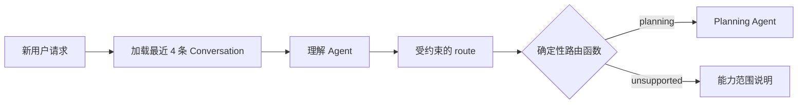

# 根图、运行控制与 Planning 衔接说明

> 本文是 `docs/architecture.md` 的专题补充。若两份文档出现冲突，以架构基线为准。

## 1. 根图的唯一业务职责

根图负责把一次新的用户请求交给正确的业务模块。它不负责完成业务，也不负责把旅行需求预先整理成一套固定字段。

当前结构为：



理解 Agent 只输出路由。它不能调用旅行搜索 Tool、修改 TripContext、写入行程或直接生成旅行方案。

## 2. 为什么采用“Agent 理解 + 程序路由”

纯规则路由难以覆盖自然语言表达；完全开放的 Root Agent 又容易承担过多业务职责。

当前设计把两者分开：

- LLM 理解用户语义；
- 结构化输出限制路由范围；
- 普通路由函数把结果映射到已注册节点；
- 未支持的意图统一进入 fallback。

这样既保留自然语言理解能力，也避免让模型任意决定系统拓扑。

## 3. 根图输入与输出

根图输入只保留支持路由判断所需的信息：

- 最新用户输入；
- 当前消息之前最近 4 条 Conversation；
- `user_id`、`trip_id` 和用于限定历史截止位置的 `user_message_id`。

理解 Agent 的 System Prompt 明确说明两种消息的边界。历史记录保留 user/assistant 角色并统一
添加【历史消息】标签，最后一条用户输入单独添加【当前消息】标签。模型只能为当前消息选择路由，
历史消息仅用于理解指代、省略和上下文承接。

根图输出是最小路由结果。Planning 所需的完整上下文由进入模块前的 Context Builder 组装，不让根图 State 承担所有模块数据。

## 4. Planning 的持续 ReAct

进入 Planning 后，Agent 可以循环执行：

```text
理解当前任务
→ 选择 Tool 或生成候选方案
→ 接收已处理的 Observation
→ 更新 TripContext / 继续搜索 / 主动提问
→ 判断当前方案是否已经足够满足用户要求
→ 请求用户确认
→ 确认后写入 CurrentItinerary
→ 结束
```

不同查询需要的信息不同，因此根图不执行全局“信息完整性检查”。缺少必要信息时，由 Planning Agent 在真正需要的位置调用 `ask_user` 并 interrupt。

## 5. 新请求、回答与取消的区别

API 必须区分三种动作：

### 5.1 新请求

会话空闲时收到用户消息：

```text
追加 Conversation
→ 从根图开始
→ 理解并路由
```

### 5.2 回答 Agent 的问题

Planning Agent 主动提问并处于等待状态时收到用户消息：

```text
追加 Conversation
→ Command(resume=用户回答)
→ 恢复原 Planning 轨迹
```

此时不重新经过根图，因为这条输入是对当前问题的回答。

### 5.3 取消后重新输入

Agent 运行期间，用户不能直接发送新的业务消息。用户必须先取消当前运行：

```text
取消当前任务
→ 废弃临时 GraphState
→ 用户提交新消息
→ 追加 Conversation
→ 从根图重新开始
```

取消不是一条对话消息，不交给 LLM。取消前的用户原始输入不能编辑或替换；用户只能在取消完成后另行发送一条新消息。后端不提供重发模式，也不自动合并两条消息。两条原始消息都保留在 Conversation 中，新运行按普通历史上下文读取，用户需要在新消息中明确说明修正内容。

## 6. API 运行事实约束

API 不保存 `IDLE / RUNNING / WAITING_USER` 状态字段，也不建立对应状态表。收到消息时直接
根据以下事实处理：

| 运行事实 | 收到消息后的行为 |
|---|---|
| 当前 `thread_id` 有活动任务 | API 拒绝输入，只允许调用取消接口 |
| 没有活动任务，checkpoint 有待恢复 interrupt | 使用 `Command(resume=...)` 恢复 Agent 提问 |
| 没有活动任务，也没有待恢复 interrupt | 从根图启动新运行 |

同一消息接口根据 checkpoint 决定“新运行”或“resume”；取消使用独立运行控制接口。当前
一个 `trip_id` 对应一个 LangGraph `thread_id`，API 为它分配进程内锁，确保两个请求不会
同时越过检查边界。不同 `thread_id` 之间互不阻塞。

如果取消操作尚未真正结束，API 不应立即启动下一次运行。先完成当前运行终止，再接受新的用户输入，可以避免两个运行同时写入同一会话状态。

## 7. 取消时的数据处理

取消后保留：

- 已经追加的用户原始消息；
- 取消前已经生效的 TripContext 更新；
- 取消前已经完成的 CurrentItinerary 写入。

取消后不保留为权威结果：

- 未完成的 Assistant 流式输出；
- 当前 ReAct 中间消息；
- 临时候选行程；
- 尚未提交的 Tool 结果；
- 被取消轨迹的后续执行位置。

取消阻止后续执行，但不撤销、回滚或补偿已经开始或完成的 DB 写入、业务 Tool 调用及外部系统操作；这些副作用保持其实际结果。当前规划阶段的大部分查询 Tools 是只读的；行程写入按照 Prompt 约束只应发生在用户确认之后。客户端应在用户取消前明确提示这一限制。

## 8. 与持久化的关系

同一会话通过运行配置携带 `thread_id`。Checkpointer 用于保存图执行状态和支持 interrupt / resume，但不能代替 Conversation、TripContext 和 CurrentItinerary 的业务持久化，也不能与一份手工维护的运行状态重复记账。

只有 Agent 主动提问后的用户回答恢复 Checkpoint。取消后的新请求虽然仍属于同一会话，但必须作为新的根图运行处理。

## 9. 当前根图明确不做什么

- 不统一提取完整旅行需求；
- 不检查一组固定字段是否齐全；
- 不承担 Planning 的上下文更新；
- 不在模块之间自由 handoff；
- 不直接执行业务 Tools；
- 不处理运行中插话；
- 不预建未来模块和空路由；
- 不把交易审批交给理解 Agent。

这些边界用于防止根图逐渐演变成难以测试的万能 Agent。

## 10. 真实模型配置与 Smoke Test

模型配置统一从项目根目录的 `.env` 或进程环境读取：

| 环境变量 | 作用 | 默认值 |
|---|---|---|
| `TOURISM_AGENT_MODEL` | OpenAI 兼容模型名称 | `gpt-4.1-mini` |
| `OPENAI_API_KEY` | 模型服务密钥 | 无 |
| `OPENAI_BASE_URL` | OpenAI 兼容 API 地址 | 不显式指定 |
| `RUN_LLM_INTEGRATION` | 是否运行真实模型测试 | `false` |

本地配置可参考 `.env.example`。`.env` 已被 Git 忽略，不应提交真实密钥。

普通测试不会调用真实模型。需要验证模型连接和结构化路由时，可临时执行：

```powershell
$env:RUN_LLM_INTEGRATION = "true"
.\.venv\Scripts\python.exe -m pytest tests\integration\test_real_model.py -q -p no:cacheprovider
```

该命令会产生真实网络请求，并可能产生模型费用。执行后可移除当前终端中的临时开关：

```powershell
Remove-Item Env:RUN_LLM_INTEGRATION
```
